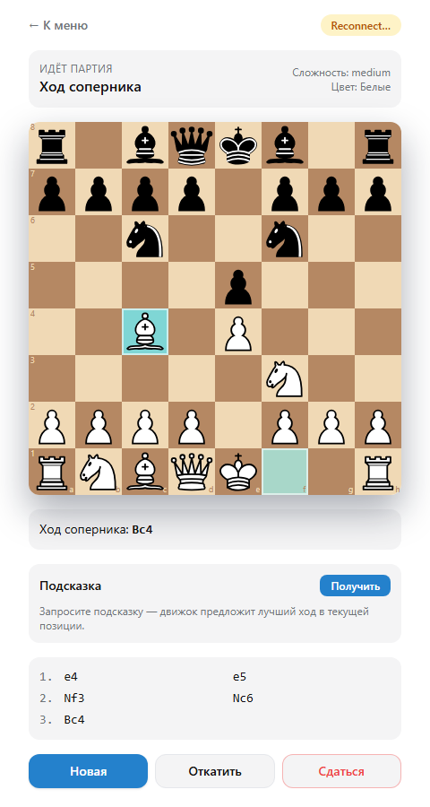

# Telegram Chess Bot

<p align="center">
  <a href="https://github.com/Mukller">
    
  </a>
</p>

[](LICENSE.md)
[](https://www.python.org/)
[](https://fastapi.tiangolo.com/)
[](https://docs.aiogram.dev/)
[](https://react.dev/)

╨Я╨╛╨╗╨╜╨╛╤Ж╨╡╨╜╨╜╤Л╨╣ Telegram-╨▒╨╛╤В ╨┤╨╗╤П ╨╕╨│╤А╤Л ╨▓ ╤И╨░╤Е╨╝╨░╤В╤Л ╨┐╤А╨╛╤В╨╕╨▓ AI ╨╜╨░ ╨▒╨░╨╖╨╡ **Stockfish**. ╨Я╨╛╨╗╨╜╨╛╤Б╤В╤М╤О ╨║╨╜╨╛╨┐╨╛╤З╨╜╤Л╨╣ ╨╕╨╜╤В╨╡╤А╤Д╨╡╨╣╤Б ╨┐╤А╤П╨╝╨╛ ╨▓╨╜╤Г╤В╤А╨╕ ╤З╨░╤В╨░ тАФ ╨┤╨╛╤Б╨║╨░ ╨║╨░╨║ ╤Б╨╡╤В╨║╨░ inline-╨║╨╜╨╛╨┐╨╛╨║, ╨▒╨╡╨╖ ╨╜╨╡╨╛╨▒╤Е╨╛╨┤╨╕╨╝╨╛╤Б╤В╨╕ ╨╖╨░╨┐╤Г╤Б╨║╨░╤В╤М WebApp. ╨в╨░╨║╨╢╨╡ ╨▓╨║╨╗╤О╤З╤С╨╜ React WebApp ╨║╨░╨║ ╨╛╨┐╤Ж╨╕╨╛╨╜╨░╨╗╤М╨╜╤Л╨╣ ╤А╨╡╨╢╨╕╨╝.

> ЁЯЗмЁЯЗз English version: [README_EN.md](README_EN.md)

<p align="center">
  
</p>

---

## ╨Т╨╛╨╖╨╝╨╛╨╢╨╜╨╛╤Б╤В╨╕

- **╨Я╨╛╨╗╨╜╨╛╤Б╤В╤М╤О ╨║╨╜╨╛╨┐╨╛╤З╨╜╨╛╨╡ ╤Г╨┐╤А╨░╨▓╨╗╨╡╨╜╨╕╨╡**: ╨╡╨┤╨╕╨╜╤Б╤В╨▓╨╡╨╜╨╜╨░╤П ╨║╨╛╨╝╨░╨╜╨┤╨░ тАФ `/start`, ╨▓╤Б╤С ╨╛╤Б╤В╨░╨╗╤М╨╜╨╛╨╡ ╤З╨╡╤А╨╡╨╖ ╨║╨╗╨░╨▓╨╕╨░╤В╤Г╤А╤Л
- **╨в╤А╨╕ ╤А╨╡╨╢╨╕╨╝╨░ ╨╕╨│╤А╤Л**:
  - ЁЯдЦ **╨Я╤А╨╛╤В╨╕╨▓ Stockfish** тАФ 8 ╤Г╤А╨╛╨▓╨╜╨╡╨╣ ╤Б╨╗╨╛╨╢╨╜╨╛╤Б╤В╨╕ ╨╛╤В ╨Э╨╛╨▓╨╕╤З╨║╨░ ╨┤╨╛ ╨У╤А╨╛╤Б╤Б╨╝╨╡╨╣╤Б╤В╨╡╤А╨░
  - ЁЯСе **Hot-seat** тАФ ╨┤╨▓╨╛╨╡ ╨╜╨░ ╨╛╨┤╨╜╨╛╨╝ ╤Г╤Б╤В╤А╨╛╨╣╤Б╤В╨▓╨╡, ╨┤╨╛╤Б╨║╨░ ╨▓╤Б╨╡╨│╨┤╨░ ╨┐╨╛╨║╨░╨╖╤Л╨▓╨░╨╡╤В╤Б╤П ╤Б ╨┐╨╛╨╖╨╕╤Ж╨╕╨╕ ╨▒╨╡╨╗╤Л╤Е
  - ЁЯМР **╨Ю╨╜╨╗╨░╨╣╨╜ PvP** тАФ ╨╕╨│╤А╨░╨╣╤В╨╡ ╤Б ╨┤╤А╤Г╨│╨╛╨╝ ╨┐╨╛ 6-╨╖╨╜╨░╤З╨╜╨╛╨╝╤Г ╨║╨╛╨┤╤Г ╨┐╤А╨╕╨│╨╗╨░╤И╨╡╨╜╨╕╤П (beta)
- **╨Ш╨║╨╛╨╜╨║╨╕ ╤Д╨╕╨│╤Г╤А ╨┤╨╗╤П ╨╛╨▒╨╛╨╕╤Е ╤Ж╨▓╨╡╤В╨╛╨▓**: ╨▒╨╡╨╗╤Л╨╡ `тЩФтЩХтЩЦтЩЧтЩШтЩЩ`, ╤З╤С╤А╨╜╤Л╨╡ `тЩЪтЩЫтЩЬтЩЭтЩЮтЩЯ`
- **╨Ф╨╛╤Б╨║╨░ ╨║╨░╨║ ╤Б╨╡╤В╨║╨░ inline-╨║╨╜╨╛╨┐╨╛╨║ 8├Ч8** ╨▒╨╡╨╖ ╨┐╨╛╨┤╨┐╨╕╤Б╨╡╨╣ ╤А╤П╨┤╨╛╨▓/╤Д╨░╨╣╨╗╨╛╨▓
- **╨Я╨╛╨┤╤Б╨▓╨╡╤В╨║╨░ ╤Е╨╛╨┤╨╛╨▓**: ЁЯЯж ╨▓╤Л╨▒╤А╨░╨╜╨╜╨░╤П ╤Д╨╕╨│╤Г╤А╨░ ┬╖ ЁЯЯв ╨▓╨╛╨╖╨╝╨╛╨╢╨╜╤Л╨╣ ╤Е╨╛╨┤ ┬╖ ЁЯЯе ╨▓╨╛╨╖╨╝╨╛╨╢╨╜╨╛╨╡ ╨▓╨╖╤П╤В╨╕╨╡
- **╨Ф╨▓╤Г╤Е╨║╨╗╨╕╨║╨╛╨▓╤Л╨╣ ╤Е╨╛╨┤**: ╤Д╨╕╨│╤Г╤А╨░ тЖТ ╨║╨╗╨╡╤В╨║╨░ ╨╜╨░╨╖╨╜╨░╤З╨╡╨╜╨╕╤П, ╨░╨▓╤В╨╛╨┐╤А╨╛╨╝╨╛╤Г╤И╨╜ ╨┐╨╡╤И╨║╨╕ ╨▓ ╤Д╨╡╤А╨╖╤П
- **╨б╤В╨░╨▒╨╕╨╗╤М╨╜╨╛╨╡ ╨╛╨▒╨╜╨╛╨▓╨╗╨╡╨╜╨╕╨╡ ╨┤╨╛╤Б╨║╨╕** тАФ ╤Г╤Б╤В╨╛╨╣╤З╨╕╨▓╤Л╨╣ ╤А╨╡╨╜╨┤╨╡╤А, ╨╛╤И╨╕╨▒╨║╨╕ `message is not modified` ╨┐╨╛╨┤╨░╨▓╨╗╤П╤О╤В╤Б╤П
- **╨Я╤А╨╛╤Д╨╕╨╗╤М ╨╕╨│╤А╨╛╨║╨░**: ELO-╤А╨╡╨╣╤В╨╕╨╜╨│ (╤Б╤В╨░╤А╤В 1200, K = 32), ╨┐╨╕╨║╨╛╨▓╤Л╨╣ ELO, ╨▓╨╕╨╜╤А╨╡╨╣╤В, ╤А╨░╨╖╨▒╨╕╨▓╨║╨░ ╨┐╨╛ ╤Г╤А╨╛╨▓╨╜╤П╨╝
- **╨Ш╤Б╤В╨╛╤А╨╕╤П ╨┐╨░╤А╤В╨╕╨╣** тАФ ╨▓╤Б╨╡ ╤Б╤Л╨│╤А╨░╨╜╨╜╤Л╨╡ ╨┐╨░╤А╤В╨╕╨╕ ╨╖╨░╨┐╨╕╤Б╤Л╨▓╨░╤О╤В╤Б╤П ╨▓ Redis ╤Б ╨╜╨░╤Б╤В╤А╨╛╨╣╨║╨░╨╝╨╕, ╨▓╤А╨╡╨╝╨╡╨╜╨╡╨╝ (╨Ь╨б╨Ъ, UTC+3) ╨╕ ╨┐╨╛╨╗╨╜╤Л╨╝ ╤Б╨┐╨╕╤Б╨║╨╛╨╝ ╤Е╨╛╨┤╨╛╨▓; ╨┤╨╛╤Б╤В╤Г╨┐ ╨╕╨╖ ╨┐╤А╨╛╤Д╨╕╨╗╤П
- ╨Я╨╛╨┤╤Б╨║╨░╨╖╨║╨░ ╨╗╤Г╤З╤И╨╡╨│╨╛ ╤Е╨╛╨┤╨░ ╨╕ ╨╛╤Ж╨╡╨╜╨║╨░ ╨┐╨╛╨╖╨╕╤Ж╨╕╨╕ (REST)
- ╨Р╤Г╤В╨╡╨╜╤В╨╕╤Д╨╕╨║╨░╤Ж╨╕╤П ╤З╨╡╤А╨╡╨╖ Telegram `initData` (HMAC-SHA256) тАФ ╨┤╨╗╤П WebApp
- WebSocket-╤Б╨╕╨╜╤Е╤А╨╛╨╜╨╕╨╖╨░╤Ж╨╕╤П ╨┐╨╛╨╖╨╕╤Ж╨╕╨╕ тАФ ╨┤╨╗╤П WebApp
- Backend authoritative тАФ ╨▓╤Б╨╡ ╤Е╨╛╨┤╤Л ╨▓╨░╨╗╨╕╨┤╨╕╤А╤Г╤О╤В╤Б╤П ╨╜╨░ ╤Б╨╡╤А╨▓╨╡╤А╨╡
- Rate limiting (30 ╨╖╨░╨┐╤А╨╛╤Б╨╛╨▓/╨╝╨╕╨╜ ╨╜╨░ ╨┐╨╛╨╗╤М╨╖╨╛╨▓╨░╤В╨╡╨╗╤П)
- ╨Я╨╛╨╗╨╜╤Л╨╣ Docker-╤Б╤В╨╡╨║: backend / frontend / redis / nginx

---

## ╨б╨║╤А╨╕╨╜╤И╨╛╤В ╨╕╨╜╤В╨╡╤А╤Д╨╡╨╣╤Б╨░ ╨▒╨╛╤В╨░

```
   тФМтФАтФАтФАтФАтФАтФАтФАтФАтФАтФАтФАтФАтФАтФАтФАтФАтФАтФАтФАтФАтФАтФАтФАтФАтФАтФАтФАтФАтФАтФАтФАтФАтФАтФР
   тФВ   тЩФ ╨Я╨░╤А╤В╨╕╤П ╨╜╨░╤З╨░╨╗╨░╤Б╤М             тФВ
   тФВ   ЁЯОп ╨г╤А╨╛╨▓╨╡╨╜╤М: ╨н╨║╤Б╨┐╨╡╤А╤В           тФВ
   тФВ   тЩФ ╨Т╤Л ╨╕╨│╤А╨░╨╡╤В╨╡: ╨▒╨╡╨╗╤Л╨╡           тФВ
   тФЬтФАтФАтФАтФАтФАтФАтФАтФАтФАтФАтФАтФАтФАтФАтФАтФАтФАтФАтФАтФАтФАтФАтФАтФАтФАтФАтФАтФАтФАтФАтФАтФАтФАтФд
   тФВ  тЩЬ  тЩЮ  тЩЭ  тЩЫ  тЩЪ  тЩЭ  тЩЮ  тЩЬ         тФВ  тЖР ╤З╤С╤А╨╜╤Л╨╡ ╤Д╨╕╨│╤Г╤А╤Л
   тФВ  тЩЯ  тЩЯ  тЩЯ  тЩЯ  тЩЯ  тЩЯ  тЩЯ  тЩЯ         тФВ
   тФВ  тмЬ тмЫ тмЬ тмЫ тмЬ тмЫ тмЬ тмЫ           тФВ  тЖР ╨┐╤Г╤Б╤В╤Л╨╡ ╨║╨╗╨╡╤В╨║╨╕ ╨▓ ╤Ж╨▓╨╡╤В
   тФВ  тмЫ тмЬ тмЫ тмЬ тмЫ тмЬ тмЫ тмЬ           тФВ
   тФВ  тмЬ тмЫ тмЬ тмЫ ЁЯЯж тмЫ тмЬ тмЫ           тФВ  тЖР ╨┐╨╛╨┤╤Б╨▓╨╡╤В╨║╨░ ╨▓╤Л╨▒╤А╨░╨╜╨╜╨╛╨╣
   тФВ  тмЫ тмЬ тмЫ тмЬ ЁЯЯв тмЬ тмЫ тмЬ           тФВ  тЖР ╨▓╨╛╨╖╨╝╨╛╨╢╨╜╤Л╨╣ ╤Е╨╛╨┤
   тФВ  P  P  P  P  тмЬ P  P  P          тФВ
   тФВ  R  N  B  Q  K  B  N  R          тФВ  тЖР ╨▒╨╡╨╗╤Л╨╡ ╤Д╨╕╨│╤Г╤А╤Л (FEN)
   тФЬтФАтФАтФАтФАтФАтФАтФАтФАтФАтФАтФАтФАтФАтФАтФАтФАтФАтФАтФАтФАтФАтФАтФАтФАтФАтФАтФАтФАтФАтФАтФАтФАтФАтФд
   тФВ  ЁЯЫС ╨Ю╤Б╤В╨░╨╜╨╛╨▓╨╕╤В╤М ╨╕╨│╤А╤Г             тФВ
   тФФтФАтФАтФАтФАтФАтФАтФАтФАтФАтФАтФАтФАтФАтФАтФАтФАтФАтФАтФАтФАтФАтФАтФАтФАтФАтФАтФАтФАтФАтФАтФАтФАтФАтФШ
```

╨С╨╡╨╗╤Л╨╡ ╤Д╨╕╨│╤Г╤А╤Л ╨╛╨▒╨╛╨╖╨╜╨░╤З╨╡╨╜╤Л ╨▒╤Г╨║╨▓╨░╨╝╨╕ `K Q R B N P` (╨▓╤Б╨╡╨│╨┤╨░ ╨▓╨╕╨┤╨╜╤Л ╨╜╨░ ╨╗╤О╨▒╨╛╨╣ ╤В╨╡╨╝╨╡), ╤З╤С╤А╨╜╤Л╨╡ тАФ ╨╖╨░╨┐╨╛╨╗╨╜╨╡╨╜╨╜╤Л╨╝╨╕ unicode-╤Б╨╕╨╝╨▓╨╛╨╗╨░╨╝╨╕ `тЩЪ тЩЫ тЩЬ тЩЭ тЩЮ тЩЯ`.

---

## ╨б╤В╨╡╨║

### Backend
- Python 3.12, FastAPI, Uvicorn
- python-chess (chess engine API)
- Stockfish (╤Б╨╡╤А╨▓╨╡╤А╨╜╤Л╨╣, ╨┐╤Г╨╗ ╨▓╨╛╤А╨║╨╡╤А╨╛╨▓)
- aiogram 3 (Telegram Bot API)
- Redis 7 (game sessions, ╤Б╤В╨░╤В╨╕╤Б╤В╨╕╨║╨░, ╨╕╤Б╤В╨╛╤А╨╕╤П, rate limiting)
- PyJWT, Pydantic v2

### Frontend (╨╛╨┐╤Ж╨╕╨╛╨╜╨░╨╗╤М╨╜╤Л╨╣ WebApp)
- React 18, TypeScript 5, Vite 5
- react-chessboard, chess.js
- Zustand
- TailwindCSS
- Telegram WebApp SDK

### Infrastructure
- Docker Compose
- Nginx (reverse proxy ╨┤╨╗╤П REST + WebSocket)

---

## ╨Р╤А╤Е╨╕╤В╨╡╨║╤В╤Г╤А╨░

```
тФМтФАтФАтФАтФАтФАтФАтФАтФАтФАтФАтФАтФАтФАтФАтФАтФАтФАтФАтФАтФАтФАтФР     тФМтФАтФАтФАтФАтФАтФАтФАтФАтФАтФАтФАтФАтФАтФАтФАтФАтФАтФАтФАтФАтФАтФАтФАтФАтФАтФАтФР
тФВ   Telegram Client   тФВ     тФВ      Browser / WebApp    тФВ
тФФтФАтФАтФАтФАтФАтФАтФАтФАтФАтФАтФмтФАтФАтФАтФАтФАтФАтФАтФАтФАтФАтФШ     тФФтФАтФАтФАтФАтФАтФАтФАтФАтФАтФАтФАтФАтФАтФмтФАтФАтФАтФАтФАтФАтФАтФАтФАтФАтФАтФАтФШ
           тФВ                              тФВ
           тФВ inline buttons               тФВ HTTPS + WSS
           тЦ╝                              тЦ╝
       тФМтФАтФАтФАтФАтФАтФАтФАтФАтФР                    тФМтФАтФАтФАтФАтФАтФАтФАтФАтФАтФР
       тФВ  Bot   тФВ                    тФВ  Nginx  тФВ
       тФВaiogram тФВ                    тФФтФАтФАтФАтФАтФмтФАтФАтФАтФАтФШ
       тФФтФАтФАтФАтФАтФмтФАтФАтФАтФШ                         тФВ
            тФВ                  тФМтФАтФАтФАтФАтФАтФАтФАтФАтФАтФАтФ┤тФАтФАтФАтФАтФАтФАтФАтФАтФАтФАтФР
            тЦ╝                  тЦ╝                     тЦ╝
       тФМтФАтФАтФАтФАтФАтФАтФАтФАтФАтФАтФР      тФМтФАтФАтФАтФАтФАтФАтФАтФАтФАтФАтФАтФР         тФМтФАтФАтФАтФАтФАтФАтФАтФАтФАтФАтФР
       тФВ FastAPI  тФВтЧАтФАтФАтФАтФАтЦ╢тФВ FastAPI   тФВ         тФВ  Static  тФВ
       тФВ  Bot Tsk тФВ      тФВ REST + WS тФВ         тФВ  bundle  тФВ
       тФФтФАтФАтФАтФАтФмтФАтФАтФАтФАтФАтФШ      тФФтФАтФАтФАтФАтФАтФАтФмтФАтФАтФАтФАтФШ         тФФтФАтФАтФАтФАтФАтФАтФАтФАтФАтФАтФШ
            тФВ                   тФВ
            тЦ╝                   тЦ╝
       тФМтФАтФАтФАтФАтФАтФАтФАтФАтФАтФАтФАтФАтФАтФАтФАтФАтФАтФАтФАтФАтФАтФАтФАтФАтФАтФАтФАтФАтФАтФАтФАтФАтФАтФАтФАтФАтФАтФАтФАтФАтФАтФАтФР
       тФВ   GameService ┬╖ StatsService ┬╖ History   тФВ
       тФФтФАтФАтФАтФАтФАтФАтФмтФАтФАтФАтФАтФАтФАтФАтФАтФАтФАтФмтФАтФАтФАтФАтФАтФАтФАтФАтФАтФАтФАтФАтФАтФАтФАтФАтФмтФАтФАтФАтФАтФАтФАтФАтФШ
              тФВ          тФВ                тФВ
              тЦ╝          тЦ╝                тЦ╝
        тФМтФАтФАтФАтФАтФАтФАтФАтФАтФАтФР  тФМтФАтФАтФАтФАтФАтФАтФАтФАтФАтФАтФАтФАтФАтФАтФАтФАтФАтФР тФМтФАтФАтФАтФАтФАтФАтФАтФАтФАтФАтФАтФР
        тФВ  Redis  тФВ  тФВ   EnginePool    тФВ тФВ  History  тФВ
        тФВ  games  тФВ  тФВ N Stockfish procтФВ тФВ (Redis 5y)тФВ
        тФВ  stats  тФВ  тФФтФАтФАтФАтФАтФАтФАтФАтФАтФАтФАтФАтФАтФАтФАтФАтФАтФАтФШ тФФтФАтФАтФАтФАтФАтФАтФАтФАтФАтФАтФАтФШ
        тФФтФАтФАтФАтФАтФАтФАтФАтФАтФАтФШ
```

---

## ╨Ъ╨╜╨╛╨┐╨╛╤З╨╜╤Л╨╣ ╨╕╨╜╤В╨╡╤А╤Д╨╡╨╣╤Б

### ╨У╨╗╨░╨▓╨╜╨╛╨╡ ╨╝╨╡╨╜╤О
- `тЩЯя╕П ╨Ш╨│╤А╨░╤В╤М` ┬╖ `ЁЯСд ╨Я╤А╨╛╤Д╨╕╨╗╤М`
- `тЭУ ╨Я╨╛╨╝╨╛╤Й╤М`

### ╨Т╤Л╨▒╨╛╤А ╤Б╨╗╨╛╨╢╨╜╨╛╤Б╤В╨╕
- `1я╕ПтГг ╨Ы╤С╨│╨║╨╕╨╣` ┬╖ `2я╕ПтГг ╨б╤А╨╡╨┤╨╜╨╕╨╣`
- `3я╕ПтГг ╨б╨╗╨╛╨╢╨╜╤Л╨╣` ┬╖ `4я╕ПтГг ╨н╨║╤Б╨┐╨╡╤А╤В`
- `тмЕя╕П ╨Э╨░╨╖╨░╨┤`

### ╨Т╤Л╨▒╨╛╤А ╤Ж╨▓╨╡╤В╨░
- `тЪк ╨С╨╡╨╗╤Л╨╡` ┬╖ `тЪл ╨з╤С╤А╨╜╤Л╨╡`
- `ЁЯО▓ ╨б╨╗╤Г╤З╨░╨╣╨╜╨╛`
- `тмЕя╕П ╨Э╨░╨╖╨░╨┤`

### ╨Т ╨╕╨│╤А╨╡
- ╨Ф╨╛╤Б╨║╨░ ╨║╨░╨║ inline-╤Б╨╡╤В╨║╨░ 8├Ч8 (╤В╨░╨┐ ╨╜╨░ ╤Д╨╕╨│╤Г╤А╤Г тЖТ ╤В╨░╨┐ ╨╜╨░ ╨║╨╗╨╡╤В╨║╤Г)
- `ЁЯЫС ╨Ю╤Б╤В╨░╨╜╨╛╨▓╨╕╤В╤М ╨╕╨│╤А╤Г` тАФ ╤Б╨╜╨╕╨╖╤Г ╨┐╨╛╨┤ ╨┐╨╛╨╗╨╡╨╝ ╨▓╨▓╨╛╨┤╨░

### ╨Я╤А╨╛╤Д╨╕╨╗╤М
- ELO, ╤А╨╡╨║╨╛╤А╨┤, ╤Б╤В╨░╤В╨╕╤Б╤В╨╕╨║╨░, ╤А╨░╨╖╨▒╨╕╨▓╨║╨░ ╨┐╨╛ ╤Г╤А╨╛╨▓╨╜╤П╨╝
- `ЁЯУЬ ╨Ш╤Б╤В╨╛╤А╨╕╤П ╨╕╨│╤А` тАФ ╤Б╨┐╨╕╤Б╨╛╨║ ╨┐╨╛╤Б╨╗╨╡╨┤╨╜╨╕╤Е 10 ╨┐╨░╤А╤В╨╕╨╣ ╤Б ╨▓╨╛╨╖╨╝╨╛╨╢╨╜╨╛╤Б╤В╤М╤О ╨╛╤В╨║╤А╤Л╤В╤М ╨┤╨╡╤В╨░╨╗╨╕ (╤Е╨╛╨┤╤Л, ╨▓╤А╨╡╨╝╤П, ELO ╨┤╨╛/╨┐╨╛╤Б╨╗╨╡)
- `ЁЯЧС ╨б╨▒╤А╨╛╤Б╨╕╤В╤М ╤Б╤В╨░╤В╨╕╤Б╤В╨╕╨║╤Г`
- `тмЕя╕П ╨Э╨░╨╖╨░╨┤`

---

## ╨б╤В╤А╤Г╨║╤В╤Г╤А╨░ ╤А╨╡╨┐╨╛╨╖╨╕╤В╨╛╤А╨╕╤П

```
.
тФЬтФАтФА backend/                     # FastAPI ╨┐╤А╨╕╨╗╨╛╨╢╨╡╨╜╨╕╨╡
тФВ   тФЬтФАтФА app/
тФВ   тФВ   тФЬтФАтФА auth/                # Telegram initData + JWT
тФВ   тФВ   тФЬтФАтФА bot/                 # aiogram bot + handlers (button-driven UI)
тФВ   тФВ   тФЬтФАтФА engine/              # Stockfish pool + difficulty profiles
тФВ   тФВ   тФЬтФАтФА game/                # GameService, StatsService, HistoryService, REST routes
тФВ   тФВ   тФЬтФАтФА middleware/          # Rate limiting
тФВ   тФВ   тФЬтФАтФА storage/             # Redis client
тФВ   тФВ   тФЬтФАтФА ws/                  # WebSocket gateway
тФВ   тФВ   тФЬтФАтФА config.py
тФВ   тФВ   тФФтФАтФА main.py
тФВ   тФЬтФАтФА Dockerfile               # Stockfish + Python
тФВ   тФФтФАтФА requirements.txt
тФЬтФАтФА frontend/                    # React + Vite WebApp (optional)
тФВ   тФЬтФАтФА src/
тФВ   тФВ   тФЬтФАтФА api/
тФВ   тФВ   тФЬтФАтФА components/
тФВ   тФВ   тФЬтФАтФА hooks/
тФВ   тФВ   тФЬтФАтФА pages/
тФВ   тФВ   тФЬтФАтФА store/
тФВ   тФВ   тФФтФАтФА types/
тФВ   тФЬтФАтФА Dockerfile
тФВ   тФФтФАтФА package.json
тФЬтФАтФА nginx/
тФВ   тФФтФАтФА nginx.conf
тФЬтФАтФА docker-compose.yml
тФЬтФАтФА .env.example
тФЬтФАтФА CHANGELOG.md
тФЬтФАтФА CODE_OF_CONDUCT.md
тФЬтФАтФА CONTRIBUTING.md
тФЬтФАтФА LICENSE.md
тФЬтФАтФА README.md
тФЬтФАтФА README_EN.md
тФФтФАтФА RELEASE_INFO.md
```

---

## ╨С╤Л╤Б╤В╤А╤Л╨╣ ╤Б╤В╨░╤А╤В

### 1. ╨б╨╛╨╖╨┤╨░╨╣╤В╨╡ Telegram ╨▒╨╛╤В╨░

1. ╨Ю╤В╨║╤А╨╛╨╣╤В╨╡ [@BotFather](https://t.me/BotFather), ╨║╨╛╨╝╨░╨╜╨┤╨░ `/newbot`
2. ╨б╨╛╤Е╤А╨░╨╜╨╕╤В╨╡ ╨┐╨╛╨╗╤Г╤З╨╡╨╜╨╜╤Л╨╣ `TELEGRAM_BOT_TOKEN`
3. (╨Ю╨┐╤Ж╨╕╨╛╨╜╨░╨╗╤М╨╜╨╛) ╨Э╨░╤Б╤В╤А╨╛╨╣╤В╨╡ WebApp ╤З╨╡╤А╨╡╨╖ `/setdomain` ╨╕╨╗╨╕ `/newapp`, ╤Г╨║╨░╨╢╨╕╤В╨╡ ╨┐╤Г╨▒╨╗╨╕╤З╨╜╤Л╨╣ URL ╨▓╨░╤И╨╡╨│╨╛ ╨┤╨╡╨┐╨╗╨╛╤П

### 2. ╨Ъ╨╗╨╛╨╜╨╕╤А╤Г╨╣╤В╨╡ ╤А╨╡╨┐╨╛╨╖╨╕╤В╨╛╤А╨╕╨╣

```bash
git clone https://github.com/Mukller/chess.git
cd chess
```

### 3. ╨Э╨░╤Б╤В╤А╨╛╨╣╤В╨╡ ╨╛╨║╤А╤Г╨╢╨╡╨╜╨╕╨╡

```bash
cp .env.example .env
# ╨Ю╤В╨║╤А╨╛╨╣╤В╨╡ .env ╨╕ ╨┐╨╛╨┤╤Б╤В╨░╨▓╤М╤В╨╡:
# TELEGRAM_BOT_TOKEN, TELEGRAM_BOT_USERNAME, TELEGRAM_WEBAPP_URL,
# APP_SECRET_KEY (╨╝╨╕╨╜╨╕╨╝╤Г╨╝ 32 ╤Б╨╗╤Г╤З╨░╨╣╨╜╤Л╤Е ╤Б╨╕╨╝╨▓╨╛╨╗╨░)
```

### 4. ╨Ч╨░╨┐╤Г╤Б╤В╨╕╤В╨╡ ╤Б╤В╨╡╨║

```bash
docker compose up -d --build
```

╨б╨╡╤А╨▓╨╕╤Б╤Л:
- `nginx` тАФ ╨┐╨╛╤А╤В `80` (frontend + REST + WS)
- `api` тАФ ╨▓╨╜╤Г╤В╤А╨╡╨╜╨╜╨╕╨╣, ╨┐╨╛╤А╤В `8000`
- `frontend` тАФ ╨▓╨╜╤Г╤В╤А╨╡╨╜╨╜╨╕╨╣, ╨┐╨╛╤А╤В `80`
- `redis` тАФ ╨▓╨╜╤Г╤В╤А╨╡╨╜╨╜╨╕╨╣, ╨┐╨╛╤А╤В `6379`

╨Я╨╛╤Б╨╗╨╡ ╤Б╤В╨░╤А╤В╨░ ╨╛╤В╨║╤А╨╛╨╣╤В╨╡ ╨▒╨╛╤В╨░ ╨▓ Telegram ╨╕ ╨╛╤В╨┐╤А╨░╨▓╤М╤В╨╡ `/start`. ╨Ф╨░╨╗╤М╤И╨╡ ╨▓╤Б╤С ╤З╨╡╤А╨╡╨╖ ╨║╨╜╨╛╨┐╨║╨╕.

### 5. Production-╤З╨╡╨║╨╗╨╕╤Б╤В

- ╨Я╨╛╤Б╤В╨░╨▓╤М╤В╨╡ Nginx ╨╖╨░ HTTPS-╤В╨╡╤А╨╝╨╕╨╜╨░╤В╨╛╤А╨╛╨╝ (Caddy / Traefik / Let's Encrypt)
- ╨г╤Б╤В╨░╨╜╨╛╨▓╨╕╤В╨╡ `APP_ENV=production` тАФ ╨▓╤Л╨║╨╗╤О╤З╨╕╤В Swagger UI
- ╨Ч╨░╨╝╨╡╨╜╨╕╤В╨╡ `APP_SECRET_KEY` ╨╜╨░ ╨┤╨╗╨╕╨╜╨╜╤Л╨╣ ╤Б╨╗╤Г╤З╨░╨╣╨╜╤Л╨╣
- ╨Э╨░╤Б╤В╤А╨╛╨╣╤В╨╡ Prometheus/Grafana/Sentry (╤Б╨╝. [RELEASE_INFO.md](RELEASE_INFO.md))

---

## ELO-╤Б╨╕╤Б╤В╨╡╨╝╨░

| ╨Я╨░╤А╨░╨╝╨╡╤В╤А                  | ╨Ч╨╜╨░╤З╨╡╨╜╨╕╨╡                     |
| ------------------------- | ---------------------------- |
| ╨б╤В╨░╤А╤В╨╛╨▓╤Л╨╣ ╤А╨╡╨╣╤В╨╕╨╜╨│         | 1200                         |
| K-╤Д╨░╨║╤В╨╛╤А                  | 32                           |
| ELO ╨┐╤А╨╛╤В╨╕╨▓╨╜╨╕╨║╨░ (╨Э╨╛╨▓╨╕╤З╨╛╨║)        | 500                    |
| ELO ╨┐╤А╨╛╤В╨╕╨▓╨╜╨╕╨║╨░ (╨Ы╤С╨│╨║╨╕╨╣)         | 800                    |
| ELO ╨┐╤А╨╛╤В╨╕╨▓╨╜╨╕╨║╨░ (╨Я╤А╨╛╤Б╤В╨╛╨╣)        | 1100                   |
| ELO ╨┐╤А╨╛╤В╨╕╨▓╨╜╨╕╨║╨░ (╨б╤А╨╡╨┤╨╜╨╕╨╣)        | 1400                   |
| ELO ╨┐╤А╨╛╤В╨╕╨▓╨╜╨╕╨║╨░ (╨Я╤А╨╛╨┤╨▓╨╕╨╜╤Г╤В╤Л╨╣)    | 1700                   |
| ELO ╨┐╤А╨╛╤В╨╕╨▓╨╜╨╕╨║╨░ (╨б╨╗╨╛╨╢╨╜╤Л╨╣)        | 1900                   |
| ELO ╨┐╤А╨╛╤В╨╕╨▓╨╜╨╕╨║╨░ (╨н╨║╤Б╨┐╨╡╤А╤В)        | 2200                   |
| ELO ╨┐╤А╨╛╤В╨╕╨▓╨╜╨╕╨║╨░ (╨У╤А╨╛╤Б╤Б╨╝╨╡╨╣╤Б╤В╨╡╤А)   | 2600                   |
| ╨г╤З╤С╤В ╨┐╤А╨╡╤А╨▓╨░╨╜╨╜╨╛╨╣ ╨┐╨░╤А╤В╨╕╨╕    | ╨║╨░╨║ ╨┐╨╛╤А╨░╨╢╨╡╨╜╨╕╨╡ (`score = 0`) |

╨д╨╛╤А╨╝╤Г╨╗╨░: `delta = K * (actual - expected)`, ╨│╨┤╨╡ `expected = 1 / (1 + 10^((opp_elo - my_elo) / 400))`.

---

## REST API

╨Т╤Б╨╡ ╤Н╨╜╨┤╨┐╨╛╨╕╨╜╤В╤Л ╤В╤А╨╡╨▒╤Г╤О╤В `Authorization: Bearer <jwt>` (╨║╤А╨╛╨╝╨╡ `/api/auth/telegram`).

| ╨Ь╨╡╤В╨╛╨┤ | ╨Я╤Г╤В╤М                          | ╨Ю╨┐╨╕╤Б╨░╨╜╨╕╨╡                                  |
| ----- | ----------------------------- | ----------------------------------------- |
| POST  | `/api/auth/telegram`          | ╨Ю╨▒╨╝╨╡╨╜ Telegram initData ╨╜╨░ access token   |
| POST  | `/api/game/start`             | ╨б╨╛╨╖╨┤╨░╤В╤М ╨╜╨╛╨▓╤Г╤О ╨┐╨░╤А╤В╨╕╤О                      |
| GET   | `/api/game/{game_id}`         | ╨Я╨╛╨╗╤Г╤З╨╕╤В╤М ╤В╨╡╨║╤Г╤Й╨╡╨╡ ╤Б╨╛╤Б╤В╨╛╤П╨╜╨╕╨╡ ╨┐╨░╤А╤В╨╕╨╕         |
| POST  | `/api/game/{game_id}/move`    | ╨б╨┤╨╡╨╗╨░╤В╤М ╤Е╨╛╨┤ (UCI: `e2e4`, `e7e8q`)        |
| POST  | `/api/game/{game_id}/hint`    | ╨Я╨╛╨┤╤Б╨║╨░╨╖╨║╨░ ╨╗╤Г╤З╤И╨╡╨│╨╛ ╤Е╨╛╨┤╨░ + ╨╛╤Ж╨╡╨╜╨║╨░ ╨┐╨╛╨╖╨╕╤Ж╨╕╨╕   |
| POST  | `/api/game/{game_id}/undo`    | ╨Ю╤В╨║╨░╤В╨╕╤В╤М ╨┐╨╛╤Б╨╗╨╡╨┤╨╜╤О╤О ╨┐╨░╤А╤Г ╤Е╨╛╨┤╨╛╨▓             |
| POST  | `/api/game/{game_id}/resign`  | ╨б╨┤╨░╤В╤М╤Б╤П                                   |
| GET   | `/health`                     | Health-check (Redis + engine + bot)       |

### WebSocket

`ws://host/ws/game/{game_id}?token=<jwt>`

╨Ъ╨╗╨╕╨╡╨╜╤В ╤И╨╗╤С╤В: `{ "type": "move", "move": "e2e4" }`, `{ "type": "resign" }`, `{ "type": "ping" }`.

╨б╨╡╤А╨▓╨╡╤А ╤И╨╗╤С╤В:
- `{ "type": "snapshot", "state": {...} }` тАФ ╨┐╤А╨╕ ╨┐╨╛╨┤╨║╨╗╤О╤З╨╡╨╜╨╕╨╕
- `{ "type": "position", "state": {...}, "player_move": "e2e4", "engine_move": {...} }`
- `{ "type": "game_over", "result": "1-0", "status": "checkmate" }`
- `{ "type": "error", "detail": "..." }`

---

## ╨г╤А╨╛╨▓╨╜╨╕ ╤Б╨╗╨╛╨╢╨╜╨╛╤Б╤В╨╕ Stockfish

| ╨г╤А╨╛╨▓╨╡╨╜╤М        | Skill Level | ╨У╨╗╤Г╨▒╨╕╨╜╨░ | ╨Т╤А╨╡╨╝╤П ╤Е╨╛╨┤╨░ | ELO ╨┐╤А╨╛╤В╨╕╨▓╨╜╨╕╨║╨░ |
| -------------- | ----------- | ------- | ---------- | -------------- |
| ╨Э╨╛╨▓╨╕╤З╨╛╨║ ЁЯРг     | 0           | 2       | 80 ms      | ~500           |
| ╨Ы╤С╨│╨║╨╕╨╣         | 3           | 4       | 150 ms     | ~800           |
| ╨Я╤А╨╛╤Б╤В╨╛╨╣        | 6           | 6       | 250 ms     | ~1100          |
| ╨б╤А╨╡╨┤╨╜╨╕╨╣        | 10          | 8       | 400 ms     | ~1400          |
| ╨Я╤А╨╛╨┤╨▓╨╕╨╜╤Г╤В╤Л╨╣    | 14          | 11      | 700 ms     | ~1700          |
| ╨б╨╗╨╛╨╢╨╜╤Л╨╣        | 17          | 14      | 1200 ms    | ~1900          |
| ╨н╨║╤Б╨┐╨╡╤А╤В        | 20          | 18      | 2500 ms    | ~2200          |
| ╨У╤А╨╛╤Б╤Б╨╝╨╡╨╣╤Б╤В╨╡╤А ЁЯСС| 20          | 24      | 5000 ms    | ~2600          |

╨Ъ╨╛╨╜╤Д╨╕╨│╤Г╤А╨░╤Ж╨╕╤П ╨▓ [backend/app/engine/config.py](backend/app/engine/config.py).

---

## ╨е╤А╨░╨╜╨╡╨╜╨╕╨╡ ╨┤╨░╨╜╨╜╤Л╤Е

| ╨Ъ╨╗╤О╤З Redis                   | TTL       | ╨б╨╛╨┤╨╡╤А╨╢╨╕╨╝╨╛╨╡                                    |
| ---------------------------- | --------- | --------------------------------------------- |
| `game:{id}`                  | 24 ╤З      | ╨Р╨║╤В╨╕╨▓╨╜╨░╤П ╨┐╨░╤А╤В╨╕╤П (FEN, ╤Е╨╛╨┤╤Л, ╤Б╤В╨░╤В╤Г╤Б)           |
| `user:{id}:games`            | 24 ╤З      | ╨Ш╨╜╨┤╨╡╨║╤Б ╨░╨║╤В╨╕╨▓╨╜╤Л╤Е ╨┐╨░╤А╤В╨╕╨╣ ╨┐╨╛╨╗╤М╨╖╨╛╨▓╨░╤В╨╡╨╗╤П           |
| `user:{id}:stats`            | 5 ╨╗╨╡╤В     | ELO, ╨▓╨╕╨╜╤А╨╡╨╣╤В, ╤А╨░╨╖╨▒╨╕╨▓╨║╨░ ╨┐╨╛ ╤Б╨╗╨╛╨╢╨╜╨╛╤Б╤В╨╕           |
| `user:{id}:history`          | 5 ╨╗╨╡╤В     | ╨Ш╨╜╨┤╨╡╨║╤Б ╨╖╨░╨▓╨╡╤А╤И╤С╨╜╨╜╤Л╤Е ╨┐╨░╤А╤В╨╕╨╣ (sorted set)        |
| `game_history:{id}`          | 5 ╨╗╨╡╤В     | ╨Ч╨░╨┐╨╕╤Б╤М ╨╖╨░╨▓╨╡╤А╤И╤С╨╜╨╜╨╛╨╣ ╨┐╨░╤А╤В╨╕╨╕ (╨┐╨╛╨╗╨╜╤Л╨╣ ╨╗╨╛╨│ ╤Е╨╛╨┤╨╛╨▓)  |
| `rl:{user}:{window}`         | 60 ╤Б      | ╨б╨║╨╛╨╗╤М╨╖╤П╤Й╨╡╨╡ ╨╛╨║╨╜╨╛ ╨┤╨╗╤П rate limiting             |

╨Ч╨░╨┐╨╕╤Б╤М ╨╕╤Б╤В╨╛╤А╨╕╨╕ ╨▓╨║╨╗╤О╤З╨░╨╡╤В: ╨╜╨░╤Б╤В╤А╨╛╨╣╨║╨╕ (╤Б╨╗╨╛╨╢╨╜╨╛╤Б╤В╤М, ╤Ж╨▓╨╡╤В), ╨▓╤А╨╡╨╝╤П ╨╜╨░╤З╨░╨╗╨░/╨║╨╛╨╜╤Ж╨░ ╨▓ **╨Ь╨б╨Ъ (UTC+3)**, ╨┐╨╛╨╗╨╜╤Л╨╣ ╤Б╨┐╨╕╤Б╨╛╨║ ╤Е╨╛╨┤╨╛╨▓ ╨▓ UCI, ╤Д╨╕╨╜╨░╨╗╤М╨╜╤Л╨╣ FEN, ELO ╨┤╨╛ ╨╕ ╨┐╨╛╤Б╨╗╨╡, ╤А╨╡╨╖╤Г╨╗╤М╤В╨░╤В.

---

## ╨Ы╨╛╨║╨░╨╗╤М╨╜╨░╤П ╤А╨░╨╖╤А╨░╨▒╨╛╤В╨║╨░

### Backend

```bash
cd backend
python -m venv .venv
source .venv/bin/activate  # Windows: .venv\Scripts\activate
pip install -r requirements.txt
# ╨г╤Б╤В╨░╨╜╨╛╨▓╨╕╤В╨╡ stockfish: apt-get install stockfish ╨╕╨╗╨╕ https://stockfishchess.org/
uvicorn app.main:app --reload
```

### Frontend

```bash
cd frontend
npm install
npm run dev
# ╨╛╤В╨║╤А╨╛╨╣ http://localhost:3000
```

╨Ф╨╗╤П ╤В╨╡╤Б╤В╨╕╤А╨╛╨▓╨░╨╜╨╕╤П ╨▓╨╜╨╡ Telegram WebApp ╨░╨▓╤В╨╛╤А╨╕╨╖╨░╤Ж╨╕╤П ╤А╨░╨▒╨╛╤В╨░╤В╤М ╨╜╨╡ ╨▒╤Г╨┤╨╡╤В (╨╜╨╡╤В ╨▓╨░╨╗╨╕╨┤╨╜╨╛╨│╨╛ `initData`). Telegram-╨▒╨╛╤В ╨╝╨╛╨╢╨╜╨╛ ╤В╨╡╤Б╤В╨╕╤А╨╛╨▓╨░╤В╤М ╨╜╨░╨┐╤А╤П╨╝╤Г╤О ╨▓ ╤З╨░╤В╨╡ ╤З╨╡╤А╨╡╨╖ `/start`.

---

## ╨С╨╡╨╖╨╛╨┐╨░╤Б╨╜╨╛╤Б╤В╤М

- Telegram initData ╨▓╨░╨╗╨╕╨┤╨╕╤А╤Г╨╡╤В╤Б╤П ╨┐╨╛ HMAC-SHA256 (╤Б╨╝. [backend/app/auth/telegram.py](backend/app/auth/telegram.py))
- ╨Т╤Б╨╡ ╤Е╨╛╨┤╤Л ╨▓╨░╨╗╨╕╨┤╨╕╤А╤Г╤О╤В╤Б╤П ╨╜╨░ ╤Б╨╡╤А╨▓╨╡╤А╨╡ ╤З╨╡╤А╨╡╨╖ python-chess тАФ ╨║╨╗╨╕╨╡╨╜╤В ╤В╨╛╨╗╤М╨║╨╛ ╨╛╤В╨┐╤А╨░╨▓╨╗╤П╨╡╤В UCI
- JWT ╤Б TTL (╨┐╨╛ ╤Г╨╝╨╛╨╗╤З╨░╨╜╨╕╤О 24 ╤З╨░╤Б╨░)
- WebSocket ╤В╤А╨╡╨▒╤Г╨╡╤В ╤В╨╛╨║╨╡╨╜ ╨▓ query string
- Redis-based rate limiting (sliding window) тАФ 30 req/╨╝╨╕╨╜ ╨╜╨░ ╨┐╨╛╨╗╤М╨╖╨╛╨▓╨░╤В╨╡╨╗╤П
- CSP ╨╕ `X-Frame-Options` ╨╜╨░╤Б╤В╤А╨╛╨╡╨╜╤Л ╨┤╨╗╤П ╨▓╤Б╤В╤А╨░╨╕╨▓╨░╨╜╨╕╤П ╨▓ Telegram

---

## Roadmap

- [x] ╨Ъ╨╜╨╛╨┐╨╛╤З╨╜╤Л╨╣ UI ╨▒╨╡╨╖ ╨║╨╛╨╝╨░╨╜╨┤
- [x] 8 ╤Г╤А╨╛╨▓╨╜╨╡╨╣ ╤Б╨╗╨╛╨╢╨╜╨╛╤Б╤В╨╕ (╨Э╨╛╨▓╨╕╤З╨╛╨║ тЖТ ╨У╤А╨╛╤Б╤Б╨╝╨╡╨╣╤Б╤В╨╡╤А)
- [x] ELO ╤А╨╡╨╣╤В╨╕╨╜╨│ ╨╕ ╨┐╤А╨╛╤Д╨╕╨╗╤М
- [x] ╨Ш╤Б╤В╨╛╤А╨╕╤П ╨┐╨░╤А╤В╨╕╨╣ ╤Б ╨┐╨╡╤А╨╡╤Б╨╝╨╛╤В╤А╨╛╨╝
- [x] Hot-seat (╨┤╨▓╨╛╨╡ ╨╜╨░ ╨╛╨┤╨╜╨╛╨╝ ╤Г╤Б╤В╤А╨╛╨╣╤Б╤В╨▓╨╡)
- [x] ╨Ю╨╜╨╗╨░╨╣╨╜ PvP ╤Б ╨╕╨╜╨▓╨░╨╣╤В-╨║╨╛╨┤╨░╨╝╨╕ (beta тАФ ╤Б╨╕╨╜╤Е╤А╨╛╨╜╨╕╨╖╨░╤Ж╨╕╤П ╨┐╨╛ ╨║╨╗╨╕╨║╤Г)
- [ ] Live ╨╛╨╜╨╗╨░╨╣╨╜ PvP ╤Б pub/sub push-╤Г╨▓╨╡╨┤╨╛╨╝╨╗╨╡╨╜╨╕╤П╨╝╨╕
- [ ] PGN ╤Н╨║╤Б╨┐╨╛╤А╤В ╨┐╨░╤А╤В╨╕╨╣
- [ ] ╨Р╨╜╨░╨╗╨╕╨╖ ╤Б╤Л╨│╤А╨░╨╜╨╜╤Л╤Е ╨┐╨░╤А╤В╨╕╨╣ ╤Б ╨┤╨▓╨╕╨╢╨║╨╛╨╝
- [ ] ╨в╤Г╤А╨╜╨╕╤А╤Л
- [ ] Puzzle / Opening trainer

╨Я╨╛╨┤╤А╨╛╨▒╨╜╨╡╨╡: [CHANGELOG.md](CHANGELOG.md) ┬╖ [RELEASE_INFO.md](RELEASE_INFO.md)

---

## ╨Т╨║╨╗╨░╨┤

PR ╨╕ issues ╨┐╤А╨╕╨▓╨╡╤В╤Б╤В╨▓╤Г╤О╤В╤Б╤П! ╨б╨╝. [CONTRIBUTING.md](CONTRIBUTING.md) ╨╕ [CODE_OF_CONDUCT.md](CODE_OF_CONDUCT.md).

---

## ╨Ы╨╕╤Ж╨╡╨╜╨╖╨╕╤П

MIT тАФ ╤Б╨╝. [LICENSE.md](LICENSE.md).

---

## ╨Ъ╨╛╨╜╤В╨░╨║╤В╤Л

- GitHub: [@Mukller](https://github.com/Mukller)
- Issues: [github.com/Mukller/chess/issues](https://github.com/Mukller/chess/issues)